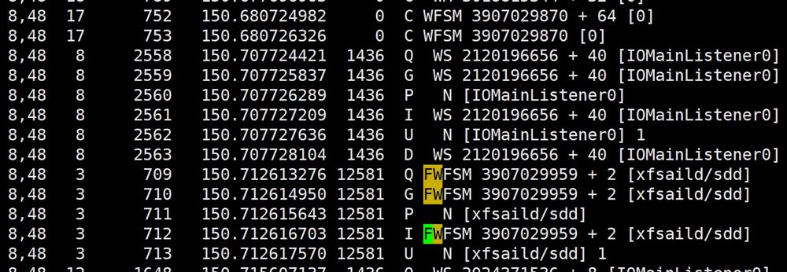
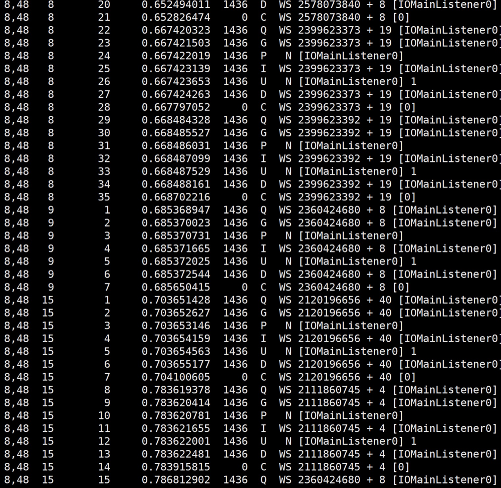

# SDD Document

### 文件系统集群机械盘IO短暂blocked，iostat显示util100%并且持续几秒无IO

希捷通过协议分析仪得到的数据，认为存在两个可疑点：

30秒定期的flush_cache指令
频繁的identify指令

选取hn02 2000 172.27.37.207 sdd进行分析，以下是sdd的smart info

### 1. smartctl

#### [Linux硬盘的检测--smartctl详细介绍](https://www.cnblogs.com/fiberhome/p/8275961.html)
#### [硬盘监控和分析工具：Smartctl](https://linux.cn/article-4682-1.html?pr)

```sh
[root@hn02-udisk-set2000-5 blktrace_sdd]# smartctl -a /dev/sdd
smartctl 7.0 2018-12-30 r4883 [x86_64-linux-4.1.0-25.el7.ucloud.x86_64] (local build)
Copyright (C) 2002-18, Bruce Allen, Christian Franke, www.smartmontools.org

=== START OF INFORMATION SECTION ===
Model Family:     Seagate Constellation ES.3
Device Model:     ST4000NM0033-9ZM170
Serial Number:    S1Z2KXA8
LU WWN Device Id: 5 000c50 08ceccf87
Firmware Version: SN06
User Capacity:    4,000,787,030,016 bytes [4.00 TB]
Sector Size:      512 bytes logical/physical
Rotation Rate:    7200 rpm
Form Factor:      3.5 inches
Device is:        In smartctl database [for details use: -P show]
ATA Version is:   ACS-2 (minor revision not indicated)
SATA Version is:  SATA 3.0, 6.0 Gb/s (current: 6.0 Gb/s)
Local Time is:    Wed Oct 23 11:18:52 2019 CST
SMART support is: Available - device has SMART capability.
SMART support is: Enabled

=== START OF READ SMART DATA SECTION ===
SMART overall-health self-assessment test result: PASSED

General SMART Values:
Offline data collection status:  (0x82)	Offline data collection activity
					was completed without error.
					Auto Offline Data Collection: Enabled.
Self-test execution status:      (   0)	The previous self-test routine completed
					without error or no self-test has ever 
					been run.
Total time to complete Offline 
data collection: 		(  600) seconds.
Offline data collection
capabilities: 			 (0x7b) SMART execute Offline immediate.
					Auto Offline data collection on/off support.
					Suspend Offline collection upon new
					command.
					Offline surface scan supported.
					Self-test supported.
					Conveyance Self-test supported.
					Selective Self-test supported.
SMART capabilities:            (0x0003)	Saves SMART data before entering
					power-saving mode.
					Supports SMART auto save timer.
Error logging capability:        (0x01)	Error logging supported.
					General Purpose Logging supported.
Short self-test routine 
recommended polling time: 	 (   1) minutes.
Extended self-test routine
recommended polling time: 	 ( 486) minutes.
Conveyance self-test routine
recommended polling time: 	 (   2) minutes.
SCT capabilities: 	       (0x50bd)	SCT Status supported.
					SCT Error Recovery Control supported.
					SCT Feature Control supported.
					SCT Data Table supported.

SMART Attributes Data Structure revision number: 10
Vendor Specific SMART Attributes with Thresholds:
ID# ATTRIBUTE_NAME          FLAG     VALUE WORST THRESH TYPE      UPDATED  WHEN_FAILED RAW_VALUE
  1 Raw_Read_Error_Rate     0x000f   075   063   044    Pre-fail  Always       -       34956964
  3 Spin_Up_Time            0x0003   092   091   000    Pre-fail  Always       -       0
  4 Start_Stop_Count        0x0032   100   100   020    Old_age   Always       -       36
  5 Reallocated_Sector_Ct   0x0033   100   100   010    Pre-fail  Always       -       2
  7 Seek_Error_Rate         0x000f   093   060   045    Pre-fail  Always       -       2268359446
  9 Power_On_Hours          0x0032   072   072   000    Old_age   Always       -       25006
 10 Spin_Retry_Count        0x0013   100   100   097    Pre-fail  Always       -       0
 12 Power_Cycle_Count       0x0032   100   100   020    Old_age   Always       -       36
184 End-to-End_Error        0x0032   100   100   099    Old_age   Always       -       0
187 Reported_Uncorrect      0x0032   100   100   000    Old_age   Always       -       0
188 Command_Timeout         0x0032   100   100   000    Old_age   Always       -       0
189 High_Fly_Writes         0x003a   100   100   000    Old_age   Always       -       0
190 Airflow_Temperature_Cel 0x0022   071   051   040    Old_age   Always       -       29 (Min/Max 27/32)
191 G-Sense_Error_Rate      0x0032   100   100   000    Old_age   Always       -       0
192 Power-Off_Retract_Count 0x0032   100   100   000    Old_age   Always       -       31
193 Load_Cycle_Count        0x0032   099   099   000    Old_age   Always       -       2578
194 Temperature_Celsius     0x0022   029   049   000    Old_age   Always       -       29 (0 21 0 0 0)
195 Hardware_ECC_Recovered  0x001a   047   015   000    Old_age   Always       -       34956964
197 Current_Pending_Sector  0x0012   100   100   000    Old_age   Always       -       0
198 Offline_Uncorrectable   0x0010   100   100   000    Old_age   Offline      -       0
199 UDMA_CRC_Error_Count    0x003e   200   200   000    Old_age   Always       -       0

SMART Error Log Version: 1
No Errors Logged

SMART Self-test log structure revision number 1
No self-tests have been logged.  [To run self-tests, use: smartctl -t]

SMART Selective self-test log data structure revision number 1
 SPAN  MIN_LBA  MAX_LBA  CURRENT_TEST_STATUS
    1        0        0  Not_testing
    2        0        0  Not_testing
    3        0        0  Not_testing
    4        0        0  Not_testing
    5        0        0  Not_testing
Selective self-test flags (0x0):
  After scanning selected spans, do NOT read-scan remainder of disk.
If Selective self-test is pending on power-up, resume after 0 minute delay.

```

### 通过blktrace工具分析
```sh
blktrace -d /dev/sdd -w 60 -D /root/yyt/blktrace_sdd
cd /root/yyt/blktrace_sdd
blkparse -i sdd.blktrace.0 > output
```

30秒定期的flush cache是由xfs文件系统下发的：




另外，通过blktrace发现频繁发生问题的磁盘上存在大量非4K对齐的IO




目前已确认问题原因是umonitor2频繁监控导致

